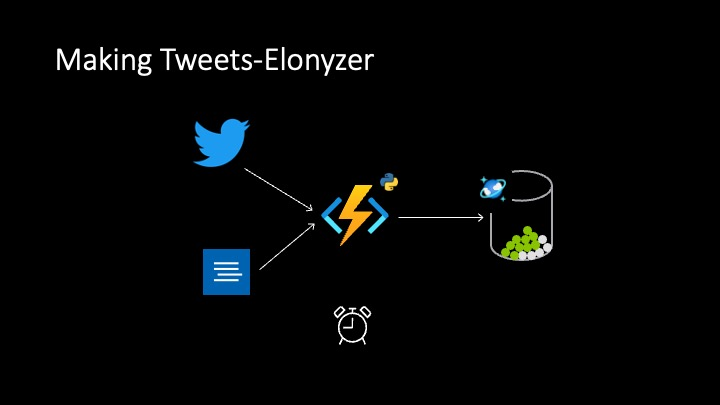

# Elonizer
### An example usecase with Azure Functions to analyze Tweets sentiment.
--- 

Expectation: Analyze tweets with Azure Functions and Store in CosmosDB.

Architecture flow: How was this created?

